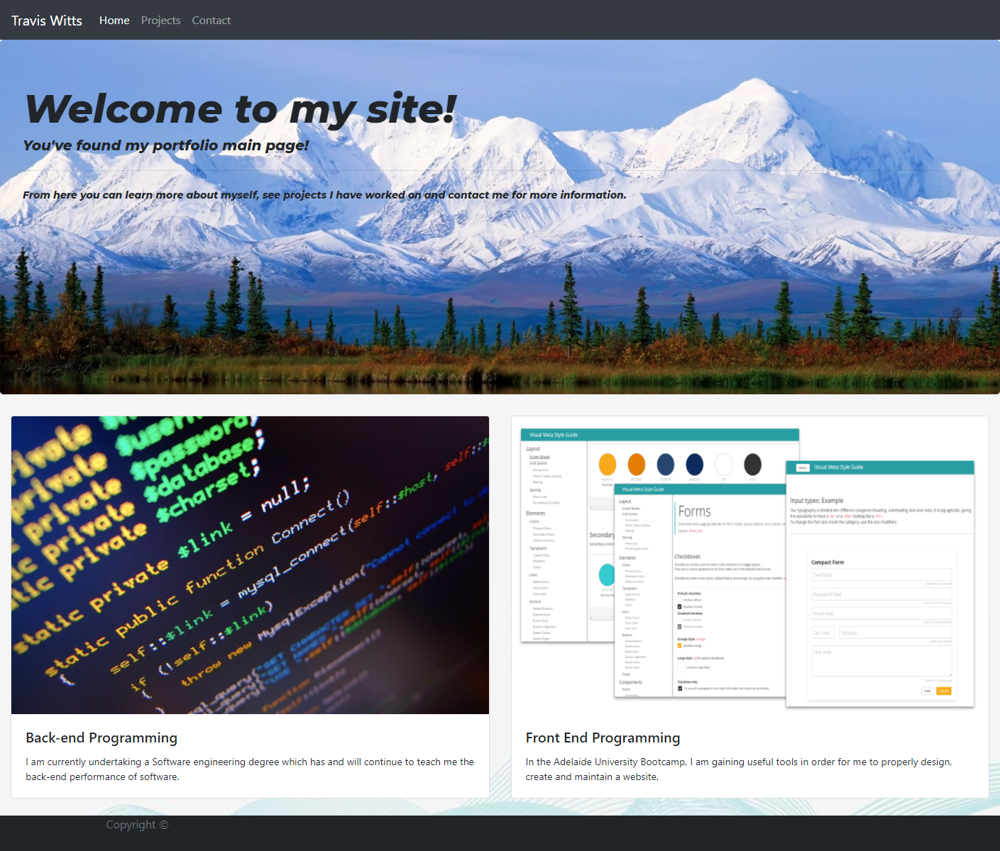

# Portfolio Page

A link to the deployed webpage is [HERE] (https://travis297.github.io/portfolio-page/)

 ## Table of Contents

* [Installation](#installation)
* [Usage](#usage)

## Installation

In order to install this website the files will need to be cloned from the repository.
Once you have the files you can either deploy it via github by pushing it to your own
repository, or have it hosted on a domain.

## Usage

As this is my own portfolio it wouldn't serve much use to anyone else aside from
as a template for their own portfolio. The personal details would have to be
changed including the links. Here is an screenshot of what the functioning site looks
like:

